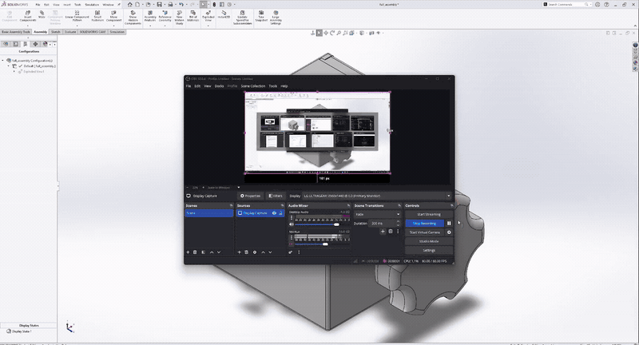
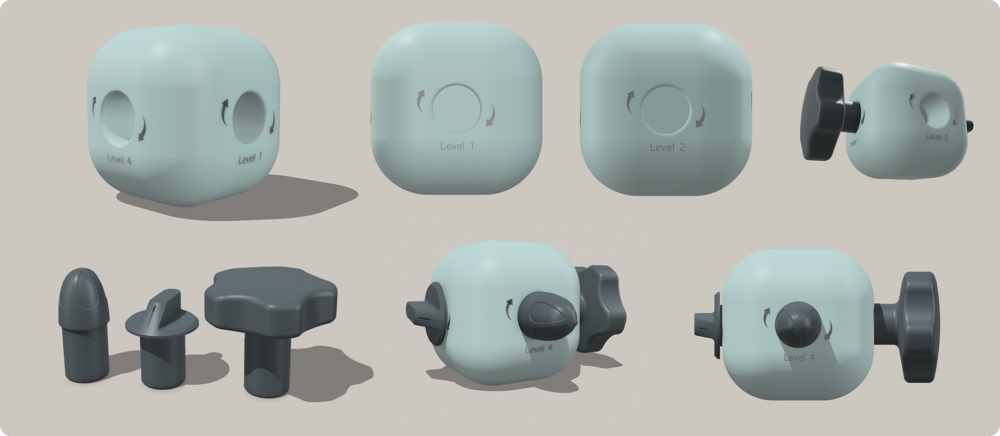
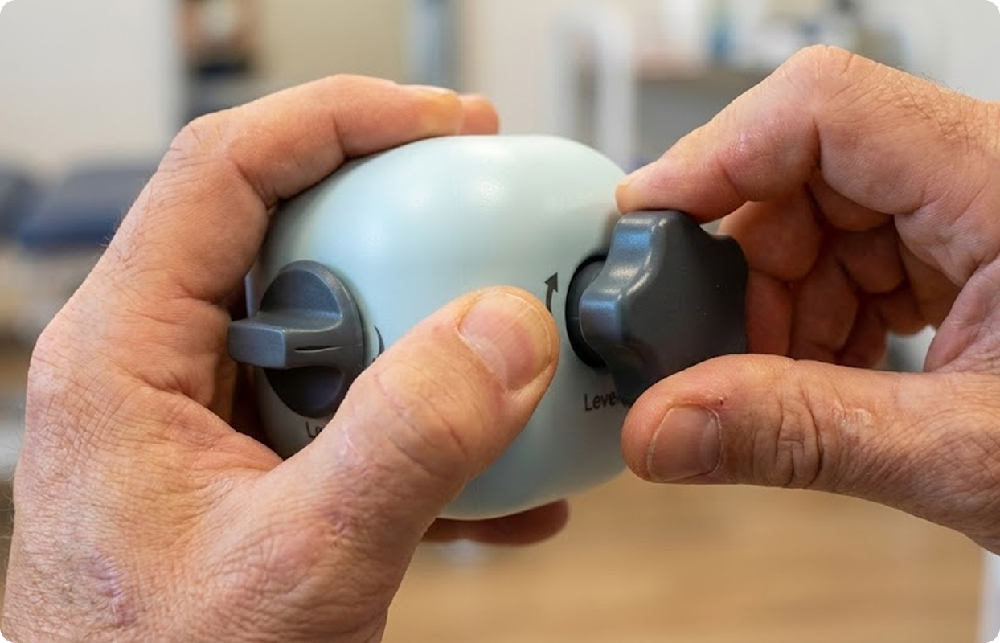
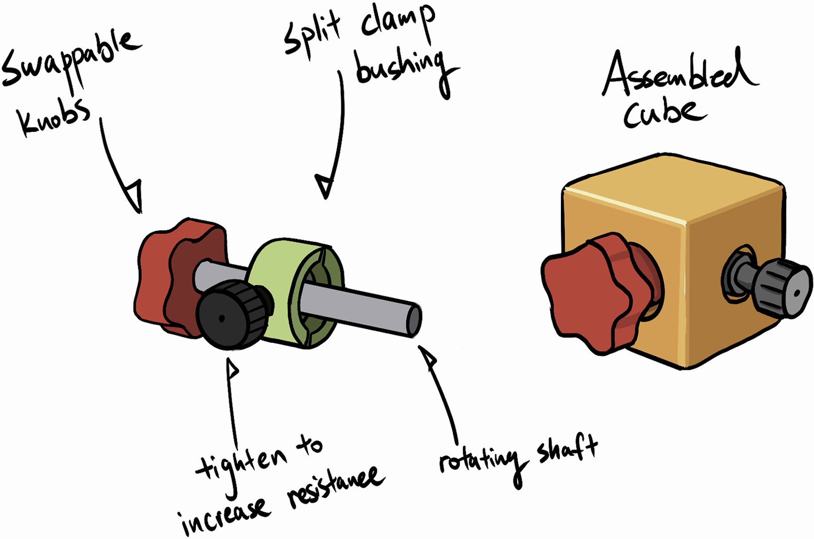
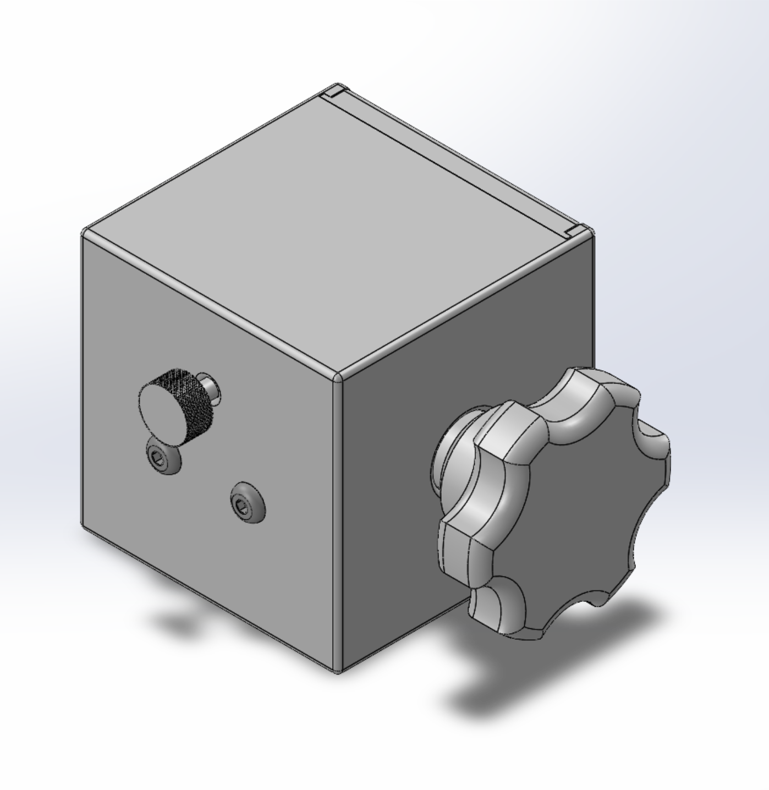
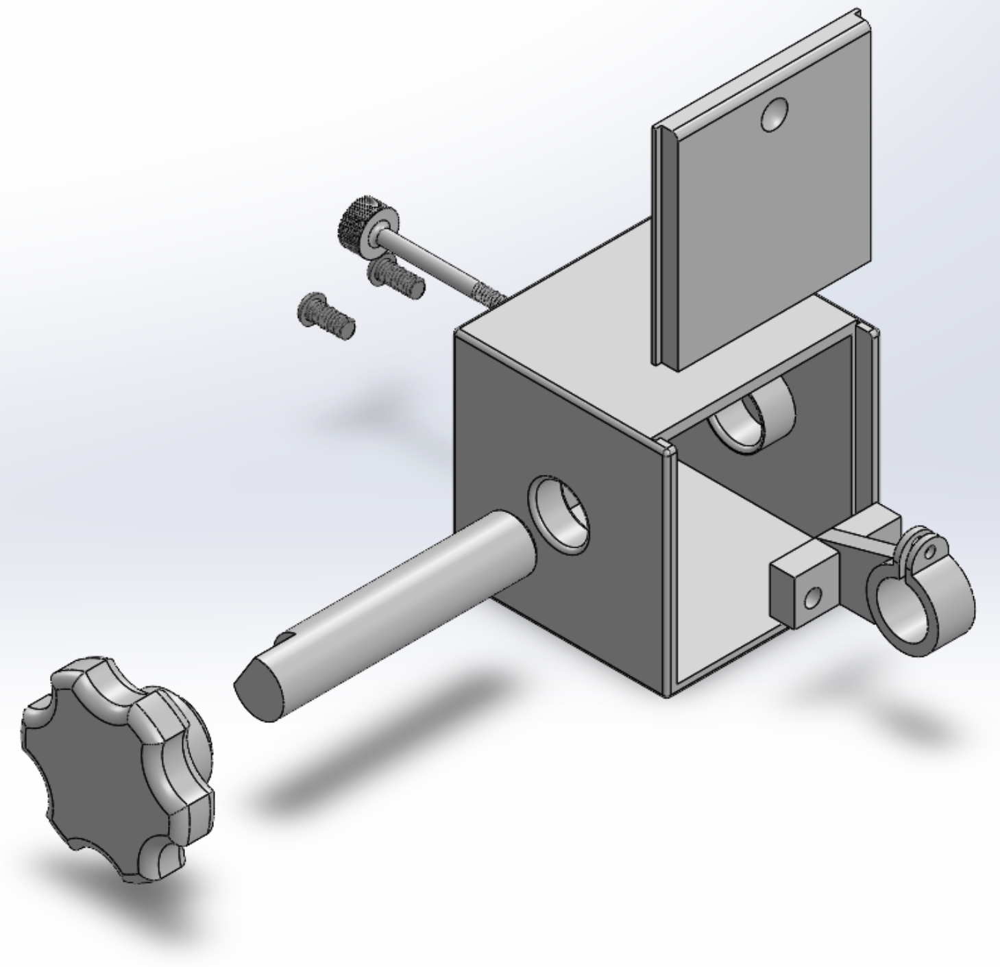

# Handyman

Handyman is a small mechanical cube for fine motor practice. You hold it in one hand and turn a knob with the other. The turn is the same kind of motion used on a stove dial, a handle, or a small control, and the resistance can be raised as the hand gets stronger.

It was designed for hand recovery after a burn, where rotation and grip have to be rebuilt in graded steps.

There is no motor, sensor, battery, or software. Resistance comes from friction inside the cube.



Version 2, played from the design model.

## What the cube trains

Most hand exercises ask you to squeeze. A ball, a piece of putty, or a grip trainer builds closing force. A lot of daily tasks are different. They ask the fingers to pinch a small shape and rotate it while the wrist stays relatively still: turning a stove knob, a faucet, a bottle cap, a door lock, or a dial on an appliance.

Those tasks are hard to grade. A household object is either turnable that day or it is not. Putty has no knob. A generic exerciser does not feel like the object the person is trying to get back to.

Handyman isolates that rotation. The cube is the stable body. The knob is the object. Difficulty is a property of the device, so the same motion can start easy and become harder without switching to a different tool.

The cube is meant for either hand. It is small enough for a clinic table or a desk.

## Primary Usecase

**Burn recovery.** After a hand burn, fine motor skill often has to be practiced on purpose: light pinch, controlled rotation, then a firmer turn, over many short sessions. Handyman gives that practice a single object. Version 1 grades the turn by which hole the knob sits in. Version 2 grades it with a screw, so the therapist or the user can change the load without taking the cube apart. The knob shapes are ordinary on purpose. Time spent turning them is time spent on the shapes of real controls.

## Where the project came from

This project was catalyzed by a collaboration between the USC Creative Media & Behavioral Health Center and the Burn Unit at Los Angeles General Medical Center (LAGMC), through a National Institute on Disability, Independent Living, and Rehabilitation Research (NIDILRR) grant. The grant’s principal investigator is Dr. Haig Yenikomshian, Associate Professor at the Keck School of Medicine and co-director of the LAGMC Burn Unit. Occupational therapists Karin Blen, Vivian Duprey Avalos, Joanna Madrid, and Joann Chun, of the LAGMC outpatient occupational therapy unit, were consulted on burn-recovery protocols for hand fine motor skill and gave verbal feedback on the prototype as it developed.

## How you use it

1. Hold the cube in the non-working hand, or brace it on a table.
2. Pinch the knob the way you would pinch the real object it stands in for.
3. Turn it through a comfortable arc, then back. The curved arrows on Version 1 mark that direction.
4. Raise the difficulty when the current setting is easy to finish: move the knob to a tighter hole (Version 1), or tighten the adjustment screw (Version 2).
5. Stop when the motion stops being controlled. For rehabilitation, that limit belongs to the therapist’s plan.

Short sets matter more than long ones. The device is there so the load can be repeated tomorrow at the same setting, or one step higher.

## Version 1

Version 1 is a rounded cube, 95 mm on each side, with four holes of different diameters. Each hole is a resistance level. A knob pressed into a larger hole turns more freely. The same knob pressed into a smaller hole meets more friction, so the turn is harder. Swapping knobs between holes is the whole adjustment.



The faces carry a level number and a rotation arrow. The current knob set has three shapes, chosen because they resemble controls people already know:

| Knob | File | Envelope | Role |
| --- | --- | --- | --- |
| Narrower knob | [`v1/stl/handyman_knob1.stl`](v1/stl/handyman_knob1.stl) | 42 × 42 × 51 mm | The smaller, taller grip |
| Stove-style pointer | [`v1/stl/handyman_knob2.stl`](v1/stl/handyman_knob2.stl) | 66 × 29 × 29 mm | A long, narrow turn, like a stove dial |
| Large knob | [`v1/stl/handyman_knob3.stl`](v1/stl/handyman_knob3.stl) | 70 × 72 × 67 mm | A broad, lobed grip |

Three knobs and four holes give up to twelve pairings: a familiar shape combined with a tighter or looser fit, in one object that can be reprinted. Each level is a printed step in fit.

More than one knob can be installed at once. The photo below shows the cube in two hands with two knobs fitted, which is how a session actually looks: one hand stabilizes, the other turns.



[`v1/stl/Handyman_v1_cube.stl`](v1/stl/Handyman_v1_cube.stl) is the 95 mm body. [`v1/stl/handy_man_full.stl`](v1/stl/handy_man_full.stl) is the body and knobs laid out together, about 208 × 196 × 95 mm, for a single print plate.

Version 1 is simple, and that simplicity has a limit. A hole is one size once it is printed. A fit that comes out slightly tight or slightly loose is corrected with a different hole, a different knob, or a new print. Version 2 adds a screw so the same cube can be eased or firmed in small steps while you hold it.

## Version 2

Version 2 keeps the cube and the everyday knob, and moves the resistance into an adjustable clamp.

The body is a 105 mm case with a lid. A shaft runs through it. The knob mounts on the outer end of the shaft. Inside, the shaft passes through a split-clamp bushing: a sleeve with a slit down one side, in the same family as a collet. A screw on the opposite face pushes that sleeve closed.



With the screw backed off, the sleeve is relaxed and the shaft turns with little drag. Turning the screw in closes the slit, the sleeve grips the shaft more evenly, and the knob takes more torque to rotate. Backing the screw off lets the sleeve open again. The knob does not change. The setting does.

The torque at the fingers is friction torque. It depends on how hard the sleeve presses on the shaft, how much surface is in contact, and the radius of the shaft. The screw only sets that pressure. One device then covers a continuous range from an easy turn to a firm one.

| Assembled | Open, so the shaft and clamp are visible |
| --- | --- |
|  |  |

The parts, measured from the print files:

| Part | File | Size |
| --- | --- | --- |
| Case | [`v2/print/case.STL`](v2/print/case.STL) | 105 × 105 × 105 mm |
| Lid | [`v2/print/lid.STL`](v2/print/lid.STL) | 100 × 99.8 mm, 10 mm thick |
| Rotating shaft | [`v2/print/rotating_shaft.STL`](v2/print/rotating_shaft.STL) | 25 mm diameter, 125 mm long, with a short 21 mm end |
| Knob | [`v2/print/knob.STL`](v2/print/knob.STL) | about 80 mm across and 40 mm thick |
| Split clamp, closer bore | [`v2/print/split_clamp_6.43mm.STL`](v2/print/split_clamp_6.43mm.STL) | 65 × 45.4 × 52 mm, 6.43 mm bore |
| Split clamp, looser bore | [`v2/print/split_clamp_6.48mm.STL`](v2/print/split_clamp_6.48mm.STL) | same envelope, 6.48 mm bore |
| Adjustment screw | [`v2/print/tighten_screw.STL`](v2/print/tighten_screw.STL) | 6.4 mm shank, 75 mm long, 20 mm knurled head |
| Lid screws | [`v2/print/screws.STL`](v2/print/screws.STL) | the pair that closes the lid |

The knob is its own part, so the grip can be swapped without redesigning the clamp. The print set includes the star knob shown in the renders. The sketch calls that out as a swappable knob: the shape can follow the task, while the resistance still comes from the screw.

The two clamp files are the same part exported at two bores, 0.05 mm apart. Printed holes rarely come out at the modeled size. The pair lets you pick the clearance that actually turns freely when the screw is loose and firms up when the screw is tightened. Start with 6.48 mm if the shaft binds with the screw fully backed off. Use 6.43 mm if the looser clamp never develops a clear resistance.

Editable SolidWorks files are in [`v2/solidworks`](v2/solidworks). The assembly is [`full_assembly.SLDASM`](v2/solidworks/final_assembly/full_assembly.SLDASM). Part files and drawings sit beside it. Check the mates there before a final print. The STLs are the print exports of that model.

## What changed between versions

| | Version 1 | Version 2 |
| --- | --- | --- |
| Body | Rounded 95 mm cube | 105 mm case with a removable lid |
| What you turn | Three knobs: pointer, large, and narrow | A shaft-mounted knob, with the star knob in the print set |
| How resistance is set | Hole diameter. Move the knob to another face | A screw closes a split clamp around the shaft |
| Steps | Four printed levels, combined with three knobs | Continuous, between loose and firm |
| In use | Several knobs can be installed together | One axis, adjusted from the opposite face |
| Correction after printing | Reprint, or use a different hole | Turn the screw, or switch clamp bore |

Version 1 is the better demonstration of “this knob feels like that object.” Version 2 is the better training device, because the load can be changed in the hand, in small amounts, and then left there for the next session.

## Printing

The files are millimeters. Version 1 is STL only. Version 2 can be printed from [`v2/print`](v2/print) or changed in SolidWorks and exported again.

A rigid filament is the right material. The clamp has to spring back when the screw is loosened, and the shaft has to stay round, so a soft or very flexible filament works against the mechanism.

A few fits dominate the print:

- Print the shaft so its axis stays round. A shaft printed lying down can come out slightly oval, and an oval shaft makes the drag uneven through the turn.
- Keep the slit in the clamp open. If the slit fuses, the screw has nothing to close.
- Print one clamp first, test it on the shaft with the screw removed, then print the other bore only if you need it.
- The lid is a 10 mm plate. It closes the case and is held by the two small screws.
- The adjustment screw has a knurled head so it can be turned by hand, without a driver, between sets.

No specific layer height or infill is required by the design. The bores are the sensitive dimensions. If your printer runs large or small, the 0.05 mm clamp pair is the intended compensation.

### Assembly, Version 2

1. Set the split clamp inside the case so its bore lines up with the shaft holes.
2. Slide the shaft through the case and through the clamp.
3. Mount the knob on the outer end of the shaft.
4. Thread the adjustment screw in from the opposite face until it bears on the clamp. Leave it loose.
5. Fit the lid and fasten it with the two small screws.
6. Turn the knob. It should spin. Tighten the knurled screw a little at a time until the turn has the resistance you want. Mark that position if you need the same load next time.

To go back to an easy turn, loosen the screw. Difficulty stays adjustable with the lid on.

## Timeline

| Date | What happened |
| --- | --- |
| September 23, 2025 | Concept |
| September 24 – November 17, 2025 | Sketches and the Version 1 design |
| September 26, 2025 | First conversation with the outpatient occupational therapists |
| November 18, 2025 | First printed Version 1 |
| December 9, 2025 | Second conversation, on the printed cube |
| December 10, 2025 onward | Version 2: the split clamp and the adjustment screw |
| March 9, 2026 | Version 2 model walkthrough recorded |

## Repository

```
docs/
  images/          renders, the Version 2 sketch, and the demo GIF
  media/           full Version 2 demo video
v1/
  stl/             Version 1 cube, three knobs, and the combined plate
v2/
  print/           print-ready STLs
  solidworks/
    required_parts/    editable parts
    final_assembly/    assembly
    drawings/          drawings
```

SolidWorks references are relative between `final_assembly`, `required_parts`, and `drawings`. Keep those three folders side by side if you move the CAD.

## Contributors

- Yiming “Danny” Huang
- Violet Wong
- Caitlyn Guo
- Ash Kim
- Yiqi “Kiwi” Li
- Marientina Gotsis

Clinical consultation, through the LAGMC outpatient occupational therapy unit: Karin Blen, Vivian Duprey Avalos, Joanna Madrid, and Joann Chun, with Dr. Haig Yenikomshian as principal investigator of the NIDILRR grant that brought the collaboration together.

## License

The design files, images, video, and this documentation are released under [CC BY-NC 4.0](https://creativecommons.org/licenses/by-nc/4.0/). You can copy, share, and build Handyman for non-commercial use if you credit the contributors. Commercial use is not allowed. The full notice is in [`LICENSE`](LICENSE).
